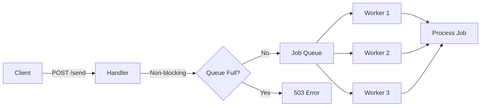

# ⚡ Go-Notify-Pump

> High-throughput notification system using Worker Pool pattern in Go


## What is this?

A simple, production-ready notification system that uses a **fixed worker pool** instead of spawning unlimited goroutines. Handles high traffic gracefully with backpressure.

```
❌ Traditional: 10,000 requests → 10,000 goroutines → 💥 Server crash
✅ This project: 10,000 requests → Buffered queue → 5 workers → ✨ Stable
```

## Features

- 🔄 **Fixed Worker Pool** - Predictable resource usage
- 📦 **Buffered Queue** - Absorbs traffic spikes
- 🛡️ **Backpressure** - Returns 503 when overloaded (doesn't crash)
- 🎯 **Graceful Shutdown** - No data loss on restart
- ⚡ **Non-blocking** - Instant API responses

## Quick Start

```bash
# Clone
git clone https://github.com/rzhbadhon/go-notify-pump.git
cd go-notify-pump

# Install dependencies
go mod download

# Run
go run cmd/api/main.go
```

Server starts on `http://localhost:7090`

## Usage

```bash
# Send notification
curl -X POST http://localhost:7090/send \
  -H "Content-Type: application/json" \
  -d '{"type": "email", "payload": "Hello World"}'

# Response
{
  "message": "Request queued",
  "job_id": "1735905600123456789"
}
```

## Project Structure

```
go-notify-pump/
├── cmd/api/main.go              # Server entry point
├── internal/
│   ├── handler/
│   │   └── notification.go      # HTTP handler
│   └── worker/
│       └── pool.go              # Worker pool logic
├── go.mod
└── README.md
```

## How It Works



## Configuration

Edit `cmd/api/main.go`:

```go
// Current settings (good for development)
wp := worker.NewWorkerPool(5, 10)  // 5 workers, 10 job buffer

srv := &http.Server{
    Addr: ":7090",  // Port
}

// Shutdown timeout
ctx, cancel := context.WithTimeout(context.Background(), 5*time.Second)
```

**Production recommendations:**
- Workers: 20-50
- Queue size: 1000-5000
- Port: 8080
- Timeout: 30s

## Key Code Snippets

### Worker Pool (`internal/worker/pool.go`)

```go
type Job struct {
    ID   string
    Type string
}

type WorkerPool struct {
    MaxWorkers int
    JobQueue   chan Job
    WG         *sync.WaitGroup
}

func (wp *WorkerPool) Run() {
    for i := 0; i < wp.MaxWorkers; i++ {
        wp.WG.Add(1)
        go func(workerID int) {
            defer wp.WG.Done()
            for job := range wp.JobQueue {
                fmt.Printf("Worker %d processing: %v\n", workerID, job)
            }
        }(i)
    }
}

func (wp *WorkerPool) ShutDown() {
    close(wp.JobQueue)  // Stop accepting jobs
    wp.WG.Wait()        // Wait for workers to finish
}
```

### Non-blocking Enqueue (`internal/handler/notification.go`)

```go
// The magic: select with default = non-blocking
select {
case h.WP.JobQueue <- job:
    c.JSON(202, gin.H{"message": "Request queued", "job_id": jobID})
default:
    c.JSON(503, gin.H{"error": "Server is busy"})
}
```

## Testing

```bash
# Run tests
go test ./...

# Load test (1k requests)
go install github.com/rakyll/hey@latest
hey -n 1000 -c 10 -m POST \
  -H "Content-Type: application/json" \
  -d '{"type":"email","payload":"test"}' \
  http://localhost:7090/send
```

## Why This Pattern?

**Problem:** Spawning a goroutine per request uses unpredictable memory and can crash your server.

**Solution:** Fixed worker pool + buffered queue = bounded resources and graceful degradation.

**Benefits:**
- Predictable memory usage (always 5 goroutines)
- System stays responsive under load
- Returns 503 instead of crashing
- Smooth traffic handling with queue buffer

## Docker

```dockerfile
FROM golang:1.25-alpine AS builder
WORKDIR /app
COPY . .
RUN go build -o notify-pump cmd/api/main.go

FROM alpine:latest
COPY --from=builder /app/notify-pump .
EXPOSE 7090
CMD ["./notify-pump"]
```

```bash
docker build -t go-notify-pump .
docker run -p 7090:7090 go-notify-pump
```

## API Reference

**Endpoint:** `POST /send`

**Request:**
```json
{
  "type": "email",
  "payload": {"any": "data"}
}
```

**Responses:**
- `202` - Job queued successfully
- `400` - Invalid JSON
- `503` - Queue full (backpressure)

## Graceful Shutdown

Press `Ctrl+C`:

```
^C
Shutting down server...
Finishing pending jobs
Worker 0 processing job: {...}
Worker stopped 0
Worker stopped 1
...
Server exiting
```

All jobs complete before exit. Zero data loss.


## Author

**Razibul Hasan Badhon** - [@rzhbadhon](https://github.com/rzhbadhon)

---

⭐ Star this repo if you found it helpful!
